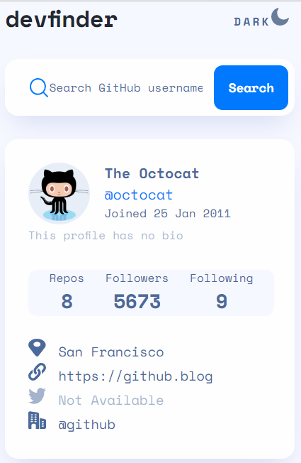
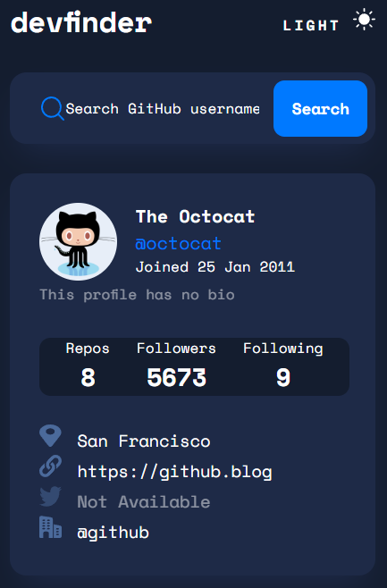
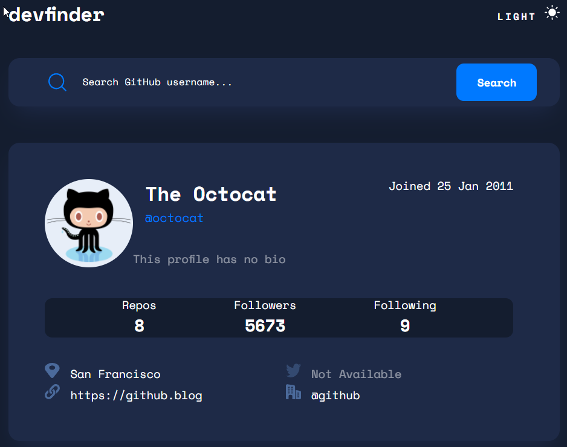

# Frontend Mentor - GitHub user search app solution

This is a solution to the [GitHub user search app challenge on Frontend Mentor](https://www.frontendmentor.io/challenges/github-user-search-app-Q09YOgaH6). Frontend Mentor challenges help you improve your coding skills by building realistic projects.

## Table of contents

- [Overview](#overview)
  - [The challenge](#the-challenge)
  - [Screenshot](#screenshot)
  - [Links](#links)
- [My process](#my-process)
  - [Built with](#built-with)
  - [What I learned](#what-i-learned)
  - [Continued development](#continued-development)
  - [Useful resources](#useful-resources)
- [Author](#author)
- [Acknowledgments](#acknowledgments)

## Overview

### The challenge

Users should be able to:

- View the optimal layout for the app depending on their device's screen size - DONE
- See hover states for all interactive elements on the page - DONE
- Search for GitHub users by their username - DONE
- See relevant user information based on their search - DONE
- Switch between light and dark themes - DONE
- **Bonus**: Have the correct color scheme chosen for them based on their computer preferences. _Hint_: Research `prefers-color-scheme` in CSS. - NOT DONE

### Screenshot

### Links

- Solution URL: [https://github.com/dsoluk/github-user-search-app](https://github.com/dsoluk/github-user-search-app)
- Live Site URL: [https://dsoluk.github.io/github-user-search-app/](https://dsoluk.github.io/github-user-search-app/)

## My process

### Built with

- Semantic HTML5 markup
- CSS custom properties for color and background color...very useful for the dark / light mode switch
- Flexbox for the layout of the 3 main sections (header, form for search bar and form for user info)
- CSS Grid for the user info...made the placement of various info items easy for different media layouts
- Mobile-first workflow
- Github user API with Fetch and template literals

### What I learned

This was my first experience using JS to bring in data from external source and injecting html code. And, figuring what a solution for the toggle (amongst researching many) was fun as well. Liked having to creatively use CSS custom properties (aka variables).

Used grid a bit more that I thought I would on this challenge. I started off thinking I could do it with Flexbox but got complicated and grid to the rescue to make it easy.

I explored using the clamp functionality as well.

### Continued development

Still struggling to efficiently get through all the code requirements. Seem to get 75% down, then struggle with hours trying to improve to match requirements (e.g. making responsive). Thinking I just need to keep practicing and maybe trying to use BEM or CUBE techniques.

### Useful resources

- [How to Implement Dark Mode with CSS and JavaScript | PullRequest Blog] (https://www.pullrequest.com/blog/how-to-implement-dark-mode-with-css-js/#:~:text=The%20CSS%20First%2C%20create%20a%20project%20with%20a,project%20and%20adds%20a%20style.css%20file%20to%20it.) - Among all the online solutions to the dark/light mode this made most sense...maybe slightly more complicated than some others.

Used Morten's LinkedIn Learn courses as well. For example, https://www.linkedin.com/learning/css-advanced-layouts-with-grid/css-grid-means-rethinking-web-layouts?autoplay=true

## Author

- Frontend Mentor - [@DSoluk](https://www.frontendmentor.io/profile/DSoluk)

## Acknowledgments

None so far
